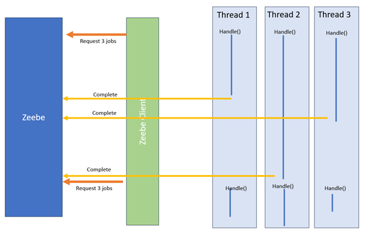
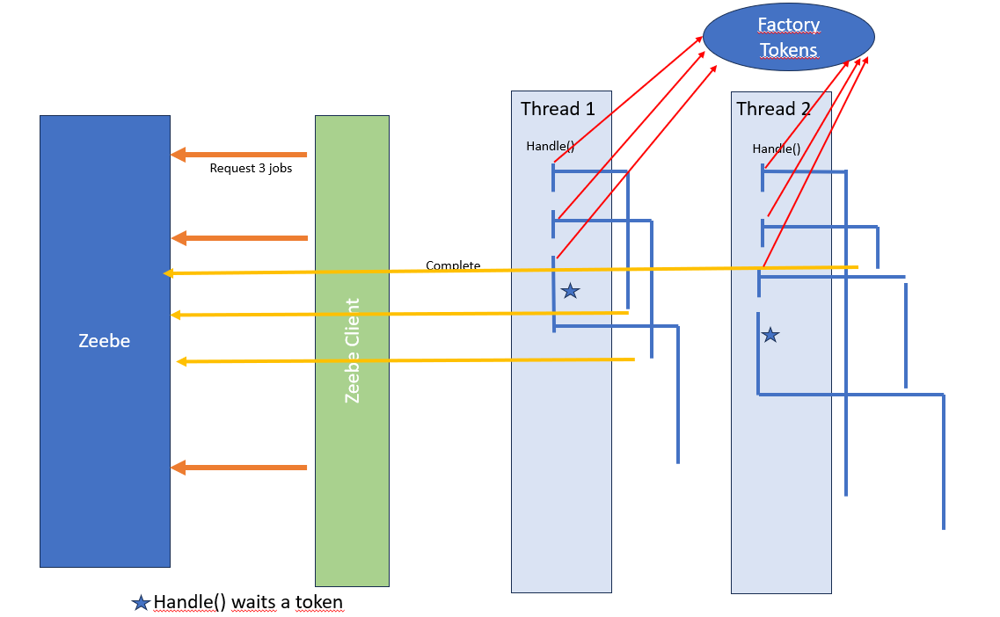

# C8-workers-implementation
This project explores the different ways to implement workers with C8. For each implementation,
impacts are explained.

The project contains all implementation, with the result in terms of performance.
Visit the Execution section if you want to run examples.

Note: This reflection is acceptable for C7 workers

# Number of jobs, number of threads

**Jobs active** method:
````
.defaultJobWorkerMaxJobsActive( <a number> )
````

The number of jobs is the number the Zeebe Client asks Zeebe. When 100 jobs are requested,
a batch of 100 jobs is returned. If there are fewer jobs, then Zeebe does not wait for 100
but returns what it has.

Zeebe Client will process these 100 jobs and ask again for a new batch only when these 100 jobs are
processed via the handle() method.

**Threads** method:
````
.numJobWorkerExecutionThreads( <a number> )
````

Multiple threads can be used to process this batch: this is the number of threads.

According to that:
* NumberOfTreads bigger than NumberOfJobs
  Specifying more threads than jobs makes no sense: NumberOfJobs will be fetched and sent to
  all threads. The other threads will never be used.

* When the NumberOfJobs is bigger than the NumberOfThreads.
  The first NumberOfThreads are immediately processed.
  Another job waits in the queue to have an available thread. So, the lock time must be addressed
  correctly: this is not the time to execute one job, but two or maybe more (number of jobs/NumberOfThread more)


# Classical Worker, Thread Worker, Thread Token Worker, Asynchronous

When you execute a service task, you can set up multiple threads and ask for multiple jobs.
Let's say you set up, for the service task "credit-charging", three threads and three jobs simultaneously.
This service task takes 1 to 5 seconds to answer.

Visit the detail on each implementation for description, advantages and concerns, and use case.

## Classical Worker

This implementation realizes the treatment in the handle method.
The test shows the efficiency is about 68 % when the worker time is homogeneous and drops when worker time is different.

Visit [Classical Worker](doc/ClassicalWorker.md) detail.



## Thread Worker (Reactive programing)
The Thread Worker implementation starts a new thread in the handle() method to execute the job.
The thread will realize the treatment.
Doing that, the handle() method terminates immediately. Zeebe Client detects that all handle method
are finished, and then ask for a new batch of jobs.

Because you don't have any limitations for Zeebe Client to catch new jobs, it will be easy and quickly
gets all work to perform, creating many threads, which may overflow the Java machine.

If the job consists of querying an external service and waiting for the answer, this solution is perfect,
when one thread listens to the answer and executes the task.

The test shows that the efficiency is about 1300 %: for 100 active threads in Zeebe,
You have 1300 threads in the Java Machine.

**Thread worker and Rest Call**
If the worker consists of call an external REST API, this pattern is perfect. The handle method do the REST call, and not wait the answer.
The result will call a lambda.

The handle() method is finished, and the Zeebe Client will ask again a new set of jobs.

When the result come, the lambda is call in a new thread. This new thread will run the completeJob() method.


Visit [Thread Worker](doc/ThreadWorker.md) detail.

Visit https://docs.camunda.io/docs/components/best-practices/development/writing-good-workers/#non-blocking--reactive-code

Visit https://blog.bernd-ruecker.com/writing-good-workers-for-camunda-cloud-61d322cad862, and especially the reactive programming section.


## Asynchronous Worker
The asynchronous call consists of sending the complete() feedback before the execution of the worker.

It is a variation of the Thread Worker. Because the Asynchronous worker does the treatment after
submitted the job, it can't update any variables or throw any errors.


This implementation has this aspect:
* The process execution is faster: the task is immediately released,
  and the process instance can advance to the next step, even if the treatment is not performed.

* Returning any values is impossible Because the feedback is sent before the treatment.
  The process instance is already advanced, and it may be finished.

* Does the treatment face an issue? Is it not possible to send an error or ask for a retry?
  The treatment is immediately done, but the ZeebeClient will not ask for a new Job until all
  handle() methods are finished


The Asynchronous call is an option to implement a worker, but the number of concerns is
very important, and this implementation is not recommended.

## Thread Token Worker
This implementation is the best to avoid the previous behavior and get the maximum threads working. On this

The idea is to control the number of threads executed simultaneously to remove the central issue in the precedent implementation.
The Concurrent Java class is used to manage a limited number of tokens.
The handle() method must first get a token to create a new thread.
It will wait if it can't get one and the handle() method is frozen.
Then, the zeebeClient will stop to request a new job for Zeebe.

Visit [Thread Token Worker](doc/ThreadTokenWorker.md) detail.




## Conclusion
The synchronous implementation is simple and should handle 80% of the use cases.

If the number of tasks to execute is essential, and the treatment may vary from job to job, then the Synchronous Limited Thread is the best option.
This implementation works even when treatment has the same time, increasing the efficiency by 30%.
Then, to handle a throughput, the number of pods can be reduced by 30%.

The limited implementation is the best because the non-limited can arrive to have a pod with exhausted resources,
and a local test can hide the issue if the number of tasks is unimportant.

If the task consists of sending a message to an external system, waiting for the answer, and completing
it with limited CPU and memory usage, the Thread Token is perfect. Just be sure
the waiting message does not consume any threads or resources.


# Execute the project

To demonstrate the different implementations, execute the current project.

# Start a local C8 environment.
The project will connect using a URL, present in `src/main/resources/application.yaml`

It will need access to Operate to calculate the time to execute all tasks.

````yaml
zeebe:
  gatewayaddress: 127.0.0.1:26500
  operateUsername: demo
  operatePassword: demo
  operateUrl: http://localhost:8081
````

# Start the application

Execute the Java class `src/main/java/org/camunda/workerimplementation/WorkerApplication.java`
It is a Spring boot application.

# Deploy and start a process

Under `src/main/resources`, different processes are available, one for each implementation.
Choose one, deploy it, and create one process instance.

or ask the application to run all tests, one by one.

````yaml
workerapplication:
  runTests: true
  # Specify the list of test to run automatically
  # List is Classical Worker,Thread Worker,Thread Token Worker,Asynchronous Worker
  runListTests: Classical,Thread,ThreadToken,Asynchronous
  
# for a test, give the Stream mode: NOSTREAM, YES: STREAM, ALL: both (2 tests)
  # NOSTREAM, STREAM, ALL
  runModeStream: ALL
  # for a test, give the Heterogeneous mode: HETEROGENEOUS, HOMOGENEOUS, ALL: both (2 tests)
  # HETEROGENEOUS, HOMOGENEOUS, ALL
  runModeHeterogeneous: ALL
````

The application will deploy each process, and then run tests according the modeStream and 
modeHeterogeneous. If both are set to ALL, this is 2x2=4 tests per process.


# Follow the execution

The first worker, `setList`, populates a list of items (parameter `zeebe.worker.sizelist`).

Each worker embedded two metrics:
**The handle metric**.
This section measures the time for the Zeebe Client handle method.

For example, the Thread worker starts when the method is called, starts the thread, and
then the handle section is finished. The actual job has not started.

**The execution metric**
This section measures the time the worker does the job. In this simulation, the execution sleeps two seconds.


Then, the monitor part shows different information in real-time.
````
 o.c.w.monitor.MonitorWorker              : Active worker efficiency: 68, InstantEfficiency: 70 % thread:7 handleWorker: (ClassicalWorker:7),(ThreadTokenWorker:0) execution:(ClassicalWorker:7),(ThreadTokenWorker:0) Total Executions:194
````
And at the end


````
o.c.w.workers.CalculateExecutionWorker   : ------------- Worker: calculateExecutionWorker PID[2251799813779385] Type[SynchronousThreadLim] in 50790 ms Efficiency: 98 %
````
**InstanceEfficiency**
This indicator is calculated by calculating the number of threads currently working (i.e., in this example, executing the method "WorkToComplete")
and the number of threads declared in the Zeebe client (parameter `zeebe.worker.jobsactive`).

Zeebe Client created all threads in the classical worker, but it will wait until all workers are finished to call a different batch.
Then, at the moment, the number of threads working is generally less than this number.

**Efficiency**

This indicator is calculated at the end. It calculates the time to execute all actions (time between the `setList` and the `calculatedExecution`)
Formula is
``````yaml
(int) (100.0 * cumulExecutionTime / nbThreadsCampaign / durationCampaign)
``````

For example, let's say the worker time to realize the operation is 2 seconds for only one thread. The process needs 5 seconds to realize this operation.
The efficiency is then (100)*2/1/4 = 50%.
If for the same amount of work (2 seconds), it takes 2 seconds, then the efficiency is 100%.

Having a value under 100% means that your Tworkers machine does not work at its full capacity. You specify 100 threads, but it used only 80% of the capacity.

However, using more than 100% is dangerous: You specify a number of threads to work, and if you use more than that, you don't have any control
and you can overload your machine.


## Result

**Stream**
When a worker is registered, it can be done using the Stream method.
With a Stream, a connection is keep opened and Zeebe give the work to the worker faster.
Each measure is realized with the stream mechanism and without.

**Homogeneous:**

It results from a list of 1000 tasks, homogeneous workers: each worker needs 5 s to complete.

| Worker              | Total time | Efficiency | Total time(Stream) | Efficiency(Stream) |
|---------------------|-----------:|-----------:|-------------------:|-------------------:|
| Classical Worker    |    735 691 |       68 % |            708 254 |               98 % |
| Thread Worker       |     37 609 |     1329 % |              7 834 |             6389 % | 
| Thread Token Worker |    511 927 |       97 % |            510 575 |               97 % | 
| Asynchronous Worker |     23 304 |     1325 % |              11056 |             4523 % | 


**Heterogeneous:**

The same simulation in a heterogeneous worker needs 5 to 15 seconds to complete the work.
The total of work is the same (total time to wait), but the distribution is heterogeneous: one
job will wait 3 seconds, and another work 7 seconds.

`Classical worker` needs more time to handle the same throughput.
`Thread Token Worker` keeps the same level of efficiency. `Thread Worker` or `Asynchronous Thread` has the
same level.

| Worker                  | Total time | Efficiency | Total time (Stream) | Efficiency(Stream) |
|-------------------------|-----------:|-----------:|--------------------:|-------------------:|
| Classical Worker        |    748 432 |       66 % |             705 344 |               98 % |
| Thread Worker           |     45 949 |     1091 % |              13 714 |             3646 % |
| Thread Token Worker     |    510 356 |       97 % |             511 022 |                97% |
| Asynchronous Worker     |     25 613 |     1406 % |              11 166 |             4468 % | 

