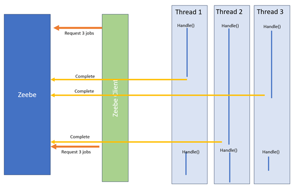

# Classical Worker implementation

In the classical mode, the service task "handles" the call, and the execution is in the
handle method.

Doing that, Zeebe's client
* Request N jobs

* Send N jobs in N different threads (call handle() method)

* Wait until the 70% of N jobs are finished to ask again for a new batch of N jobs.
  If the execution varies between 1 to 5 seconds, it will wait for the most extended execution to ask
  again for the next job: it will wait 5 seconds. So, the pod may have a low CPU time execution.

See [JobWorkerImpl.java](https://github.com/camunda/zeebe/blame/main/clients/java/src/main/java/io/camunda/zeebe/client/impl/worker/JobWorkerImpl.java)

Some threads will not be used when a new job is requested. So, the worker does not work with a
100% efficiency.
* To have 100% efficiency, use only one thread.
* Or request a batch higher than the number of threads: Thread 1 will pick up a new job when
* it finishes. The issue is still here at the end of the batch.

## Advantages
This implementation is simple and very efficient with one thread.

## Concerns
When you configure the worker with multiple threads and tasks, this method
is less efficient: the library waits for the last execution of the batch
to query a new batch of jobs. If execution time varies between jobs,
the worker may face a situation where only some threads work; in the worst case,
one line works on a long job, and another thread is not used.
This implementation is inefficient if the worker calls an external service and waits for feedback to execute
the task.

## Use case
This is the default implementation. If the platform does not face high throughput, this is the most simple implementation.

