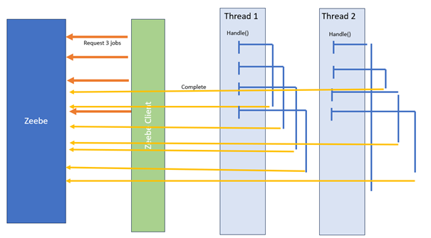
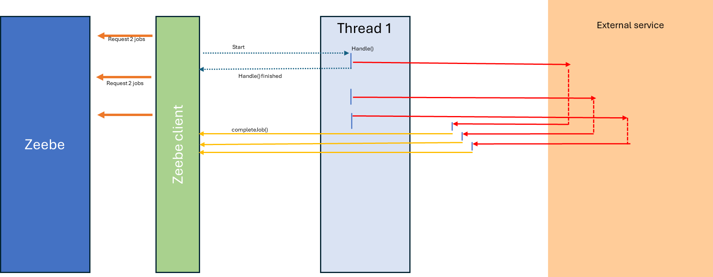

# Thread Worker (Reactive programing) implementation

In the Thread mode, the service task "handles" the call, starts a new thread to do the execution,
and finishes the handle() method. So, from the Zeebe Client's point of view, jobs are completed, and
it can ask for a new batch of jobs.

It looks perfect, except the Zeebe Client will not stop requesting jobs. If the execution needs
some CPU resources or memory, you may overflow the worker.

Looking for efficiency, you may require 100 threads, but your worker may run more than that.

**Thread worker and Rest Call**
If the work consist of call an external task pattern, this is the better pattern.Do not wait the REST call response, but register a lambda to execute the result.
Thiw way, the thread does not wait the answer.

Via this pattern, the number of thread is limited to the number of thread dedicated to the worker, plus threads to manage the answer.

Visit https://blog.bernd-ruecker.com/writing-good-workers-for-camunda-cloud-61d322cad862, and especially the reactive programming section.

## Advantages
This implementation is compelling if the worker has no CPU and sends a request to an
external service; it is a better approach than the classical implementation. Then, one thread is
dedicated to listening to the result and completing the job.

If the worker consists of executing a REST API and waiting actively for the return, this method is
acceptable because it does not consume any CPU or Memory during the waiting time, but a lot of
threads are generated.

## Concerns
The main concern of this implementation is that you do not control the number of threads your worker
can run. If 10,000 tasks are waiting, one worker like this can quickly acquire them.

## Use case
If the worker consists of sending a request to an external service and waits for the answer, it is the perfect pattern.
The handle() method can throw the request directly (or create a thread to throw the request), and one thread expects the result to complete the task.
